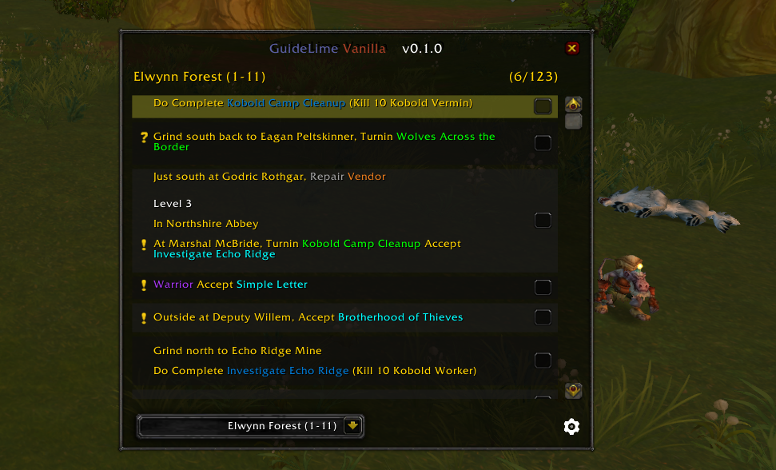

<div align="center">

# GuideLime Vanilla

## ⚠️ **$\color{rgb(255,0,0)}{\textsf{WORK IN PROGRESS}}$** ⚠️

</div>

A World of Warcraft Classic (1.12) addon providing an enhanced guide system with automatic quest tracking and autonomous navigation. **Includes Sage 1-60 Alliance leveling guides!**

## Screenshots

 


## Features

### 📚 Smart Guide System
- **Dynamic Step Management**: Automatically tracks completed and active quest steps
- **Checkbox Interface**: Visual progress tracking with clickable checkboxes
- **Step Highlighting**: Active steps highlighted with distinctive yellow color
- **Auto-scrolling**: Automatically scrolls to show the current active step
- **Ongoing Steps**: Special steps stay pinned at top (in blue) while you continue the guide - perfect for "kill X mobs" objectives that span multiple steps
- **XP Tracking**: Shows progress for grind/XP requirement steps
- **Built-in Guides**: Includes Sage 1-60 Alliance leveling guides

### 🗺️ Autonomous Navigation System
- **Custom Arrow Display**: Built-in navigation arrow (no TomTom needed!)
- **Automatic Waypoints**: Creates waypoints for quest objectives automatically
- **Smart Coordinate Selection**: Automatically selects the best location based on step type (quest giver, turn-in NPC, or objective area)
- **Zone-Aware Navigation**: Arrow automatically hides when in different zones and updates when you enter the correct zone
- **[TAR] Tag Support**: Navigate to specific NPCs using [TAR] tags in guides
- **Quest Objectives Display**: Shows kill/collect progress directly on the navigation frame
- **Real-time Distance Updates**: Color-coded distance indicators (green=close, yellow=medium, red=far)
- **Movable Frame**: Hold Shift + drag to reposition the arrow

### 🎯 Quest Tracking
- **Automatic Progress**: Checks off steps when quests are accepted, completed, or turned in
- **Multi-step Support**: Handles steps with multiple quest actions
- **Quest State Persistence**: Saves progress between sessions
- **Flight Path Tracking**: Automatically detects discovered flight paths and flight destinations
- **Hearthstone Tracking**: Automatically completes hearthstone steps when you arrive at your destination
- **Quest Abandonment Handling**: Properly updates state when quests are abandoned
- **XP Progress Bars**: Visual colored progress bars for grind/XP requirement steps showing current progress

### 🎨 User Interface
- **Clean Design**: Organized interface with consistent styling
- **Clickable Icons**: Special action icons (Hearthstone, items to use)
- **Color-coded Steps**: Visual distinction between step types and states
- **Quest Tags**: Colored markers for accept and turnin steps

## Installation

1. Download and extract to `World of Warcraft/Interface/AddOns/`
2. Rename folder to `GuidelimeVanilla` (remove `-master` if needed)
3. Restart WoW or `/reload`

## Usage

1. Select a guide from the dropdown menu
2. Follow the steps - checkboxes update automatically
3. Navigation arrow guides you to objectives
4. Click checkboxes manually if needed

## Adding Guides

Create a `.lua` file in `Guides/` using this format:
```lua
GLV:RegisterGuide([[
[N 1-10 My Guide Name]
[GA Alliance]
[D Guide description]

[QA123] Accept quest
[QC123] Complete objectives
[QT123] Turn in quest
[O][QC456] Ongoing step - stays pinned while you continue
[G 45.5,32 Westfall] Go to specific coordinates
[TAR823] Navigate to NPC with ID 823
[P Stormwind] Get flight path
[F Stormwind] Fly to destination - auto-completes when flight is taken
[H Stormwind] Use hearthstone - auto-completes when you arrive at destination
[NX 10-20 Next Guide Name]
]], "My Guides")
```

Add to `Guides/guides.xml`:
```xml
<Script file="MyGuides\My_Guide.lua"/>
```

## Acknowledgments

- **Sage** - 1-60 Alliance leveling guides
- **Shagu** - Quest/NPC/Item databases (ShaguDB)
- **Laytya** - Spells database
- **Astrolabe** - Coordinate management library
- **Original Guidelime** - Inspiration

## Support

Issues or feature requests? [Open a ticket on GitHub](https://github.com/JeromeM/GuidelimeVanilla/issues)

---

**Happy questing!**
