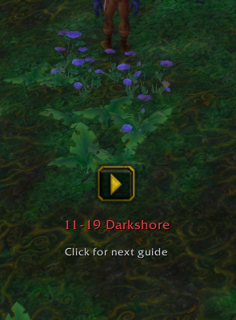

<div align="center">

# GuideLime Vanilla

## ⚠️ **$\color{rgb(255,0,0)}{\textsf{WORK IN PROGRESS}}$** ⚠️

</div>

A World of Warcraft Classic (1.12) addon providing an enhanced guide system with automatic quest tracking and autonomous navigation. **Includes Sage 1-60 Alliance leveling guides!**

## Requirements

- **[Nampower](https://github.com/pepopo978/nampower)** - Required for spell learning detection and other advanced features

## Screenshots

#### Guide Full Screen :


#### Guide Window :
 

#### Arrow :
  

## Features

### 📚 Smart Guide System
- **Dynamic Step Management**: Automatically tracks completed and active quest steps
- **Checkbox Interface**: Visual progress tracking with clickable checkboxes
- **Step Highlighting**: Active steps highlighted with distinctive yellow color
- **Auto-scrolling**: Automatically scrolls to show the current active step
- **Ongoing Steps**: Special steps stay pinned at top (in blue) while you continue the guide - perfect for "kill X mobs" objectives that span multiple steps
- **XP Tracking**: Shows progress for grind/XP requirement steps
- **Built-in Guides**: Includes Sage 1-60 Alliance leveling guides

### 🗺️ Autonomous Navigation System
- **Custom Arrow Display**: Built-in navigation arrow (no TomTom needed!)
- **Automatic Waypoints**: Creates waypoints for quest objectives automatically
- **Smart Coordinate Selection**: Automatically selects the best location based on step type (quest giver, turn-in NPC, or objective area)
- **Zone-Aware Navigation**: Arrow automatically hides when in different zones and updates when you enter the correct zone
- **Quest Objectives Display**: Shows kill/collect progress directly on the navigation frame
- **Real-time Distance Updates**: Color-coded distance indicators (green=close, yellow=medium, red=far)
- **Interactive Navigation Icons**: Navigation frame displays context-specific clickable icons:
  - **Hearthstone Icon**: Click to use hearthstone on hearthstone steps, auto-completes after cast
  - **Equip Item Icon**: Shows items that need to be equipped
  - **Next Guide Button**: Clickable button on final step to load next guide
- **Movable Frame**: Hold Shift + drag to reposition the arrow

### 🎯 Quest Tracking
- **Automatic Progress**: Checks off steps when quests are accepted, completed, or turned in
- **Multi-step Support**: Handles steps with multiple quest actions
- **Quest State Persistence**: Saves progress between sessions
- **Automation Settings**: Optional automation features available in Settings > Guides:
  - **Auto Accept Quests**: Automatically accepts quests when on a quest accept step
  - **Auto Turnin Quests**: Automatically turns in quests when on a quest turnin step (skips if reward choice required)
  - **Auto Take Flights**: Automatically takes flights when on a flight path step
- **Flight Path Tracking**: Automatically detects discovered flight paths and flight destinations
- **Hearthstone Tracking**: Click the hearthstone icon in navigation frame on hearthstone steps to use hearthstone, step auto-completes after cast
- **Spell Learning Tracking**: Automatically completes learn spell steps when you train skills or spells (uses Nampower API for profession tier verification)
- **Quest Abandonment Handling**: Properly updates state when quests are abandoned
- **XP Progress Bars**: Visual colored progress bars for grind/XP requirement steps showing current progress

### 🎨 User Interface
- **Clean Design**: Organized interface with consistent styling
- **Clickable Icons**: Special action icons (Hearthstone, items to use)
- **Color-coded Steps**: Visual distinction between step types and states
- **Quest Tags**: Colored markers for accept and turnin steps
- **Display Settings**: Customizable UI scaling available in Settings > Display:
  - **Guide Text Scale** (0.8-1.5): Adjust the size of guide step text
  - **Navigation Scale** (0.8-1.5): Adjust the size of the navigation arrow frame
  - **Auto-reload**: UI automatically reloads when display settings are changed for instant effect

## Installation

1. Download and extract to `World of Warcraft/Interface/AddOns/`
2. Rename folder to `GuidelimeVanilla` (remove `-master` if needed)
3. Restart WoW or `/reload`

## Usage

1. Select a guide from the dropdown menu
2. Follow the steps - checkboxes update automatically
3. Navigation arrow guides you to objectives
4. Click checkboxes manually if needed

## Creating Custom Guides

GuideLime Vanilla supports custom guide creation using a simple tagged format. Create a `.lua` file in the `Guides/` folder and use the guide syntax to define steps.

### Basic Example

```lua
GLV:RegisterGuide([[
[N 1-10 My Guide Name]
[GA Alliance]
[D Guide description\\Line 2\\Line 3]

Accept quest example step
Complete quest objectives step
Turn in quest step
Ongoing step - stays pinned while you continue
Go to specific coordinates in Westfall
Navigate to an NPC
Get flight path at Stormwind
Fly to Stormwind - auto-completes when flight is taken
Use hearthstone at Stormwind - auto-completes when you arrive
Learn a spell - auto-completes when spell is learned
Link to next guide (shows clickable button on final step)

Multi-line step text example:\\Take the boat and wait for it to depart.\\Craft bandages or fish while you wait.
]], "My Guides")
```

Add your guide file to `Guides/guides.xml`:
```xml
<Script file="MyGuides\My_Guide.lua"/>
```

### Guide Formatting Tips

- **Line Breaks**: Use `\\` (double backslash) to create line breaks in step text and descriptions
  - Example in description: `[D Guide info\\Website: example.com\\Discord: link]`
  - Example in steps: `Take the boat to Auberdine\\Craft bandages while you wait`
- **Special Tags**: The guide format uses bracketed tags to indicate actions (quest accept, turnin, navigation targets, etc.)
- **Multiple Actions**: A single step can contain multiple quest actions that all need completion

For detailed guide syntax documentation, see the [TAGS.md](TAGS.md) file or examine existing guides in the `Guides/` folder.

## Acknowledgments

- **Sage** - 1-60 Alliance leveling guides
- **Shagu** - Quest/NPC/Item databases (ShaguDB)
- **Astrolabe** - Coordinate management library
- **Original Guidelime** - Inspiration

## Support

Issues or feature requests? [Open a ticket on GitHub](https://github.com/JeromeM/GuidelimeVanilla/issues)

---

**Happy questing!**
