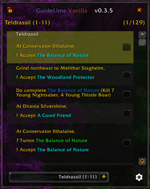
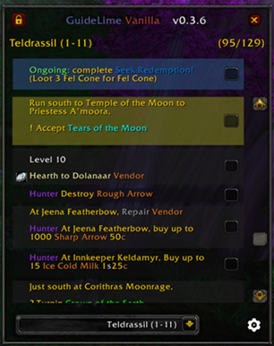
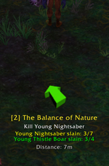
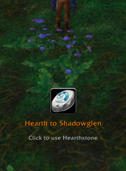

<div align="center">

# GuideLime Vanilla

## ⚠️ **$\color{rgb(255,0,0)}{\textsf{WORK IN PROGRESS}}$** ⚠️

</div>

A World of Warcraft Classic (1.12) addon providing an enhanced guide system with automatic quest tracking and autonomous navigation. Optimized for Turtle WoW with custom quest and NPC database support.

## Requirements

- **[Nampower](https://github.com/pepopo978/nampower)** - Required for spell learning detection and other advanced features

## Guide Packs

GuidelimeVanilla is a guide engine - guides are provided as separate addons:

| Guide Pack | Description |
|------------|-------------|
| **[GuidelimeVanilla_Sage](https://github.com/JeromeM/GuidelimeVanilla_Sage)** | Sage 1-60 Alliance leveling guides |

Install GuidelimeVanilla + a guide pack addon, then select your guide pack in **Settings > Guides**.

## Screenshots

#### Guide Full Screen :


#### Guide Window :
 

#### Arrow :
  

## Features

### 🗺️ Autonomous Navigation
- **Built-in arrow** pointing to your next objective — no TomTom needed
- **Multi-waypoint sequences** that auto-advance as you reach each destination (5 yard threshold)
- **Dotted path** on minimap and world map showing the way
- **pfQuest integration**: optional "Hide pfQuest Nodes" setting (off by default) suppresses pfQuest map pins when paths are active to avoid clutter — greyed out when pfQuest is not installed
- **Live quest progress** (kill/collect counters) displayed on the navigation frame
- **Clickable action icons**: hearthstone, equip item, use item, next guide — one click does it all
- **Corpse navigation**: die and the arrow guides you back with a ghostly blue tint

### 📚 Smart Guide Engine
- **Hands-free tracking**: quests, items, spells, gear — everything auto-detects and checks off
- **Quest sync on guide load**: automatically completes accept steps for quests already in your log
- **Ongoing steps** stay pinned at top for long objectives like "grind to level X"
- **Item collection tracking**: works on both current and ongoing steps automatically
- **Equipment auto-completion**: steps with "Equip" text and item IDs auto-complete when you equip the item
- **XP progress bar** with real-time tracking for grind steps
- **Skill/profession tracking**: progress bars for skill levels (First Aid, Cooking, weapon skills, etc.) with auto-completion
- **Clickable URLs**: URLs in guide text appear as blue [Link] placeholders — click to open a popup with the full URL for easy copying
- **Guide packs** as separate addons — install what you need, or create your own
- **TurtleWoW database support**: built-in override system for TurtleWoW-specific quests, NPCs, and items — fully compatible with pfQuest (no shared globals)

### ⚡ Automation & Smart Skip
- **Auto-take flights** on matching steps
- **Auto-skip impossible turnins**: steps with quest turnins for quests not in your log are automatically completed
- All optional, all toggleable in Settings

### 🌟 Talent Suggestions
- **Level-up popup** tells you exactly which talent to pick next
- **Green glow** on the recommended talent in your talent frame
- Pre-built leveling templates for all 9 classes (TurtleWoW optimized)

### 🎨 Clean UI
- **Minimap button** for quick access (left-click guide, right-click settings)
- Modern dark theme with adjustable text and arrow scale

## Installation

1. Download and extract to `World of Warcraft/Interface/AddOns/`
2. Rename folder to `GuidelimeVanilla` (remove `-master` if needed)
3. Restart WoW or `/reload`

## Usage

1. Select a guide pack in **Settings > Guides** and click **Load**
2. Follow the steps — checkboxes update automatically as you play
3. The navigation arrow guides you to each objective

### Slash Commands

- `/glv show` / `/glv hide` - Toggle the guide window
- `/glv settings` - Open settings

## Creating Custom Guide Packs

Guide packs are separate addons that register guides with GuidelimeVanilla.

### Guide Pack Structure

```
GuidelimeVanilla_MyGuides/
├── GuidelimeVanilla_MyGuides.toc
├── init.lua
├── Guide_Zone1.lua
└── Guide_Zone2.lua
```

### Example .toc file

```
## Interface: 11200
## Title: Guidelime Vanilla - My Guides
## Notes: Custom leveling guides
## Dependencies: GuidelimeVanilla

init.lua
Guide_Zone1.lua
Guide_Zone2.lua
```

### Example init.lua

```lua
local GLV = LibStub("GuidelimeVanilla")
if not GLV then
    DEFAULT_CHAT_FRAME:AddMessage("|cFFFF0000[My Guides]|r GuidelimeVanilla is required!")
    return
end

-- Optional: Register starting guides for automatic guide selection per race
GLV:RegisterStartingGuides("My Guides", {
    ["Human"] = "Elwynn Forest",
    ["Dwarf"] = "Dun Morogh",
    ["Gnome"] = "Dun Morogh",
    ["NightElf"] = "Teldrassil",
    ["Orc"] = "Durotar",
    ["Troll"] = "Durotar",
    ["Tauren"] = "Mulgore",
    ["Undead"] = "Tirisfal Glades",
})
```

### Example Guide File

```lua
local GLV = LibStub("GuidelimeVanilla")
GLV:RegisterGuide([[
[N 1-10 My Zone Guide]
[GA Alliance]
[D Guide description\\Line 2\\Line 3]

Accept quest example step
Complete quest objectives step
Turn in quest step
]], "My Guides", "GuidelimeVanilla_MyGuides")  -- Third parameter is optional addon name for metadata
```

### Guide Pack API Reference

**`GLV:RegisterGuide(guideText, groupName, addonName)`**
- `guideText`: The guide content with tagged format
- `groupName`: The guide pack name (e.g., "My Guides")
- `addonName`: (Optional) The addon folder name for metadata lookup

**`GLV:RegisterStartingGuides(packName, raceMapping)`**
- `packName`: The guide pack name (must match the groupName used in RegisterGuide)
- `raceMapping`: Table mapping race names to starting guide names
- Race names: `Human`, `Dwarf`, `Gnome`, `NightElf`, `Orc`, `Troll`, `Tauren`, `Undead`
- TurtleWoW custom races (like `HighElf`) are automatically aliased to standard races if not explicitly mapped
- Guide names must match the guide name defined in your guide files

### Guide Formatting Tips

- **Line Breaks**: Use `\\` (double backslash) to create line breaks in step text and descriptions
- **Special Tags**: The guide format uses bracketed tags to indicate actions (quest accept, turnin, navigation targets, etc.)
- **Multiple Actions**: A single step can contain multiple quest actions that all need completion
- **Class/Race Filtering**: Use `[A]` tags to show steps only for specific classes or races
  - Single tag with mixed types uses AND logic: `[A Dwarf, Human, Priest]` means "(Dwarf OR Human) AND Priest"
  - Multiple tags are AND'd together: `[A Dwarf, Human] [A Priest]` has the same effect
  - Supports: Warrior, Paladin, Hunter, Rogue, Priest, Shaman, Mage, Warlock, Druid, Human, Dwarf, Night Elf, Gnome, Orc, Undead, Tauren, Troll
- **TOC Notes**: Add a `## Notes:` line in your .toc file - it will be displayed in the guide pack selection dropdown

For detailed guide syntax documentation, see the [TAGS.md](TAGS.md) file.

## Creating Custom Talent Templates

Guide pack developers can create custom talent templates for any class using the talent template API.

### Basic Talent Template

```lua
local GLV = LibStub("GuidelimeVanilla")

GLV:RegisterTalentTemplate("MAGE", "Fire Leveling", "leveling", {
    [10] = {2, 1, 2},  -- Fire tree, row 1, column 2
    [11] = {2, 1, 2},  -- Same talent, rank 2
    [12] = {2, 2, 1},  -- Fire tree, row 2, column 1
    -- ... continue to level 60
})
```

### Template with Respec Transition

For builds that benefit from resetting talents mid-leveling:

```lua
GLV:RegisterTalentTemplate("WARRIOR", "Arms to Fury", "leveling",
    -- Phase 1: Arms (levels 10-39)
    {
        [10] = {1, 1, 2},
        [11] = {1, 1, 2},
        -- ... continue to level 39
    },
    -- Phase 2: Respec configuration (optional 5th parameter)
    {
        respecAt = 40,
        message = "Reset talents at a class trainer and go Fury!",
        talents = {
            [40] = {2, 1, 3},  -- Fury tree talents
            [41] = {2, 1, 3},
            -- ... continue to level 60
        }
    }
)
```

### Talent Template API Reference

**`GLV:RegisterTalentTemplate(class, name, templateType, talents, respec)`**

Parameters:
- `class` (string): Class name in UPPERCASE - "WARRIOR", "MAGE", "PRIEST", etc.
- `name` (string): Template display name - appears in Settings > Talents dropdown
- `templateType` (string): Either "leveling" or "endgame"
- `talents` (table): Talent assignments by level - `{[level] = {tree, row, col}}`
- `respec` (table, optional): Respec configuration for mid-leveling build transitions
  - `respecAt` (number): Level to show respec notification
  - `message` (string): Custom notification message (default: "Reset your talents at a class trainer!")
  - `talents` (table): Phase 2 talent assignments - `{[level] = {tree, row, col}}`

**Tree, Row, Column Format:**
- `tree`: Talent tree index (1, 2, or 3) - see WoW talent frame
- `row`: Row number (1-7) - higher rows require more points in tree
- `col`: Column number (1-4) - position within row

**Example:**
```lua
[15] = {1, 3, 2}  -- Tree 1, Row 3, Column 2 at level 15
```

### Setting a Default Template

To make your template the default recommendation for a class:

```lua
GLV.DefaultTalentTemplates = GLV.DefaultTalentTemplates or {}
GLV.DefaultTalentTemplates["MAGE"] = "Fire Leveling"
```

## Acknowledgments

- **Sage** - 1-60 Alliance leveling guides
- **Shagu** - Quest/NPC/Item databases (ShaguDB)
- **Astrolabe** - Coordinate management library
- **Original Guidelime** - Inspiration

## Support

Issues or feature requests? [Open a ticket on GitHub](https://github.com/JeromeM/GuidelimeVanilla/issues)

---

**Happy questing!**

